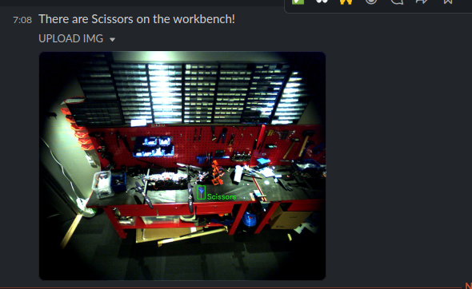

# Detecting misplaced tools
A collection of Python scripts that from a RTSP-stream, using an [YOLOv5](https://github.com/ultralytics/yolov5) model trained on in-house synthetic data, alerts hardware members with Slack notifications if there are misplaced tools on the workbench.

<p align="center">

</p>

## Intalling

1. Clone the repo

2. Create a python virtual environment

```
python3 -m venv .bvenv
```

3. Source the environment
```
source .bvenv/bin/activate
```

4. Install the required pip packages

```
pip3 install -r requirements.txt
```

## Usage
Create a file named vars.py at the root containing the slack tokens:
```
SLACK_BOT_TOKEN = "xoxb-{some string}
SLACK_APP_TOKEN = "xapp-{some string}
```
Set approperiate weights and update the camera connection in big-brother.py
```
weight_path = "weights/best.pt"
camera_url = "rtsp://big-brother:8554/ueye"
```
Then you should be able to run
```
python3 big-brother.py
```


# Structure

## big-brother.py
This is the driver script. Weights and camera connection is set at the bottom of this file.

## big-brother-utils.py
Image manipulation, formatting and detection

## slackapi.py
Intereaction with the [Slack API](https://api.slack.com/methods)

## constants.py
The tool list and implementation specific constants

## random_messages.py
A collection of different messages

# Dependencies
Check out requirements.txt
